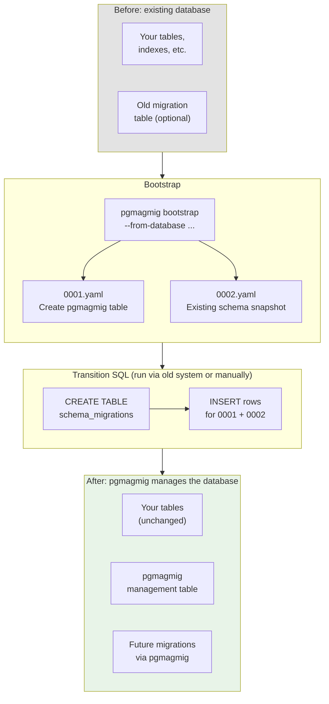

# Existing Database

If you have an existing database — whether managed by another migration tool or maintained manually — pgmagmig can capture its current schema and take over migration management from there.

## 1. Bootstrap with your existing schema

Point `bootstrap` at your existing database:

```bash
pgmagmig bootstrap \
  --migrations-dir ./migrations \
  --from-database postgres://localhost/mydb
```

Or if you have your schema as SQL files:

```bash
pgmagmig bootstrap \
  --migrations-dir ./migrations \
  --from-sql schema.sql
```

This creates two files:

- **`0001.yaml`** — creates pgmagmig's management table.
- **`0002.yaml`** — captures your entire existing schema.

## 2. Register the migrations in your database

Open `0001.yaml`. At the top you'll find a comment block with exact SQL to run:

```sql
CREATE TABLE public.schema_migrations (
  sequence integer PRIMARY KEY,
  uuid uuid NOT NULL,
  title text NOT NULL,
  down text
);

INSERT INTO public.schema_migrations (sequence, uuid, title, down) VALUES
    (1, '<uuid-from-0001>', 'Create pgmagmig management table', NULL),
    (2, '<uuid-from-0002>', 'Existing database schema', NULL);
```

The UUIDs in the comment match the ones in `0001.yaml` and `0002.yaml`.

Run this SQL against your database using whatever mechanism you currently use — your existing migration tool, a manual `psql` session, or a deployment script. This creates the pgmagmig management table and records both bootstrap migrations as already applied, which is correct: the management table now exists (from the SQL you just ran) and the rest of the schema was already there.

## 3. Verify the state

```bash
pgmagmig migrate \
  --migrations-dir ./migrations \
  --database-url postgres://localhost/mydb \
  --check
```

This should report "Database is up to date." If it doesn't, the schema in your database differs from what pgmagmig extracted — investigate before proceeding.

## 4. Clean up the old system (optional)

If your previous migration system had its own management table (e.g., `schema_migrations` from Rails, `_prisma_migrations` from Prisma, `alembic_version` from Alembic), you can now create a pgmagmig migration to drop it:

```bash
# Add the old table to your schema SQL as a reminder, then:
pgmagmig draft-migration \
  --migrations-dir ./migrations \
  --to-sql schema.sql \
  --title "Remove old migration table" \
  --allow-hazards all
```

Or write the migration by hand — it's just a YAML file with `DROP TABLE` in the `up` field.

## How it works

The two-migration bootstrap captures a clean baseline:



- **Migration 1** is the management table itself. It exists so that pgmagmig can manage its own infrastructure through the same mechanism it manages everything else.
- **Migration 2** is a snapshot of the existing schema at the point of adoption. It has no down migration (`down` is omitted), because rolling back the entire existing schema is not meaningful.

From this point forward, all schema changes go through pgmagmig. The migration history starts clean, with a clear record of what the database looked like when pgmagmig took over.
