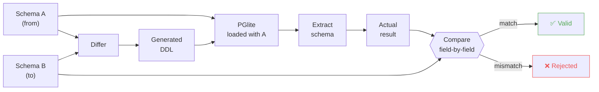

# Migration Philosophy

pgmagmig has strong opinions about how database migrations should work. These opinions exist because schema migrations are one of the most dangerous operations in a production system — they're irreversible, they run against live data, and mistakes are expensive. The design choices below all serve the same goal: **make it hard to accidentally break your database**.

## Sequential numbering: git conflicts are a feature

Migration files are named `0001.yaml`, `0002.yaml`, `0003.yaml`, and so on. Numbering must be consecutive starting at 1 — any gap is an error.

This is a deliberate choice. When two developers on separate branches both create `0032.yaml`, the second branch to merge gets a git conflict. That conflict forces a conversation: does the new migration still make sense given the one that just landed? Do they interact? Is the ordering correct?

Timestamp-based filenames (like `20240315120000_add_users.sql`) avoid this conflict, which sounds convenient but is dangerous. Two migrations developed in parallel may both merge and deploy without conflict, but produce a schema that neither developer intended. The interactions between concurrent migrations are exactly the kind of thing that needs human review.

In spirit, this forced serialisation is not unlike PostgreSQL's `SERIALIZABLE` transaction isolation level. `SERIALIZABLE` makes reasoning about concurrent transactions simple by ensuring they behave as if they ran one at a time. Sequential migration numbering does the same thing for schema changes: by forcing developers to serialise their migrations, it makes reasoning about the cumulative effect simple. Each migration is authored with full knowledge of every migration before it.

## The management table is part of the schema

pgmagmig's management table (`schema_migrations` by default) is not hidden or special. It appears in schema extractions, diffs, and generated DDL like any other table. If you define your target schema via `--to-sql`, the management table must be included.

This is intentional. The management table is a real table in your database. Pretending it doesn't exist leads to surprises — for example, a diff that tries to drop it because it wasn't in the target schema.

## Transaction-safe DDL only

Every migration runs inside a single transaction. If any statement fails, the entire migration is rolled back and the management table remains consistent.

This means pgmagmig deliberately avoids statements that cannot run inside a transaction:

- `CREATE INDEX CONCURRENTLY`
- `ALTER TYPE ... ADD VALUE`
- `REINDEX CONCURRENTLY`

These are genuinely useful in production for large tables, and support for non-transactional migrations is planned as a future extension. But the default is safety: a failed migration leaves no half-applied state.

## Hazards are structured, not cosmetic

When pgmagmig generates a diff, destructive or dangerous statements are tagged with a structured hazard type — not a free-text comment. Each hazard has a machine-readable type (`DeletesData`, `AcquiresAccessExclusiveLock`, etc.) and a human-readable message.

This serves two purposes:

1. **Developer review.** When you draft a migration, the hazard comments in the YAML file tell you exactly what's risky. You can't miss a `DROP COLUMN` buried in a long migration.
2. **CI gating.** The `--check-hazards` flag lets you fail a CI pipeline if a migration introduces hazards that haven't been explicitly acknowledged. This catches accidental destructive changes before they reach production.

Hazards are a best-effort signal, not a guarantee of completeness. New hazard types may be added over time as the tool learns about more dangerous patterns.

## Verification by construction

pgmagmig doesn't trust its own output. Every diff is automatically verified by applying it to a real PostgreSQL engine and checking the result:

If the comparison fails, the diff is rejected. This catches bugs in the differ itself, edge cases in DDL generation, and subtle interactions between schema objects.

For `draft-migration`, both directions are validated: the up migration transforms A to B, and the down migration transforms B back to A.

## Readable output

pgmagmig's differ produces DDL that reads like something a human would write. A new table is a single `CREATE TABLE` statement with columns, defaults, constraints, and NOT NULL inlined — not a bare table followed by twenty `ALTER TABLE` statements.

This matters because migration files are reviewed by humans. The easier they are to read, the more likely a reviewer will catch a mistake.
